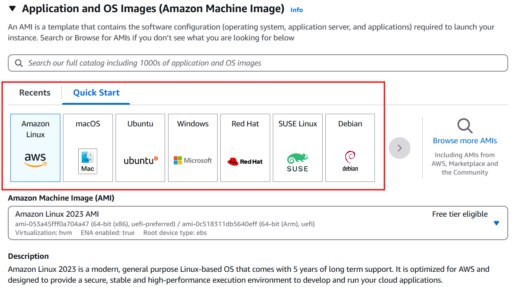
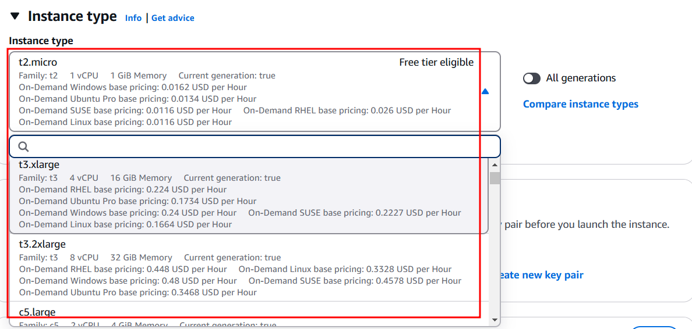
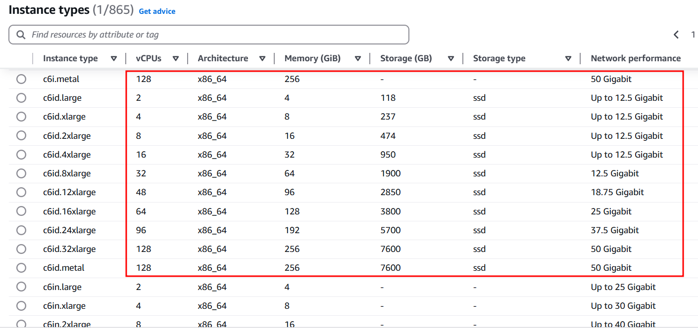

# AWS EC2 기본 개념

## AWS IaaS

- AWS EC2는 AWS가 제공하는 IaaS 서비스다.
- IaaS(Infrastructure as a Service) : 인프라를 서비스로 제공하는 클라우드 모델을 의미한다.
- 제공자는 하드웨어 리소스(서버, 스토리지, 네트워크 장비)를 가상화하여 제공하고 사용자는 해당 리소스를 임대하여 사용한다.
- 사용자는 자신의 비즈니스 요구사항에 맞게 CPU, 메모리, 스토리지 설정이 가능하다.
- 트래픽이 증감여부에 따라 유동적으로 리소스를 추가하거나 줄일 수가 있어 비즈니스에 빠른 대응이 가능하다.
- 사용한 만큼만 지불하는 종량제 모델로 운영된다.

## AWS Region(리전)

- 리전은 AWS가 전 세계에 분산하여 구축된 물리적 데이터 센터 그룹을 의미한다. ex) 서울 리전 : 한국 내 위치한 데이터 센터 그룹
- 사용자와 가까운 리전일수록 네트워크 레이턴시를 줄일 수 있다.
- 각 리전끼리는 완전히 분리되어 있어 특정 리전에서 발생한 장애가 다른 리전에 간섭하지 않는다.

## 가용 영역(Availability Zone, AZ)

- 리전 내에 존재하는 하나 이상의 독립된 데이터 센터를 의미한다. ex) 서울 리전에는 여러 개의 가용 영역(AZ)가 존재한다.
- 각 AZ는 물리적으로 분리되어 있어 자연재해로 인한 간섭을 분리할 수 있다.
- 리전 내 AZ 끼리는 네트워크로 연결되어 있어 빠른 데이터 동기화 및 백업이 가능하다.

## AMI(Amazone Machine Image)

- 인스턴스 구성 정보(OS, 애플리케이션 서버, 애플리케이션, 관련 설정 정보)들이 포함된 이미지를 의미한다.
- AMI 이미지를 통해 EC2 인스턴스 생성이 가능하다.
- 인스턴스 생성 시, 선택한 베이스 AMI에 포함된 OS와 소프트웨어 환경을 기반으로 서버가 구축된다.
- 이미 운영 중인 인스턴스를 기반으로 현재 서버 상태(애플리케이션, 설정)을 그대로 복사한 커스텀 AMI를 생성 가능하다.
- 동일한 AMI를 기반으로 여러 인스턴스를 동시에 시작하여 오토 스케일링 환경을 구축할 수 있다.
- AMI는 리전에 종속되므로 다른 리전에서 사용을 원할 시 따로 AMI를 복사해서 이용해야 한다.
- AMI를 백업해두면 동일 환경의 인스턴스를 빠르게 구축 가능하다.
- 인프라 자동화 도구 (AWS CloudFormation)과 연계하여 AMI를 이용해 일관된 배포 환경을 구축 가능하다.

## 인스턴스 유형

- 가상 머신의 성능과 용량을 결정하는 사양을 의미한다.
- 인스턴스 유형 이름은 알파벳과 숫자 조합으로 되어 있어 가상 머신 스펙을 쉽게 파악 가능하다.
- 패밀리 ex) t, m, c, r : 인스턴스 이름의 첫 글자는 인스턴스의 역할이나 특성을 의미한다.
- 세대 번호 ex) t2, m5 : 패밀리의 세대(업그레이드 버전)을 의미한다.
- 크기 ex) micro, small, medium : vCPU 수 및 메모리(RAM) 용량이 커질수록 큰 크기로 분류된다.
- 인스턴스 타입을 선택할 때는, vCPU, 아키텍처, 메모리, 스토리지, 대역폭 등을 고려해야 한다.

