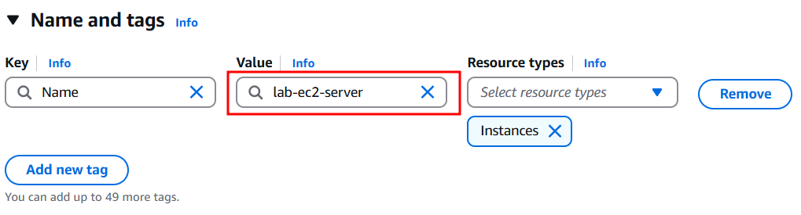
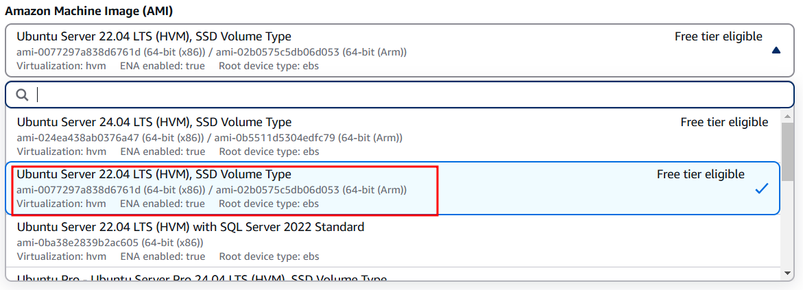
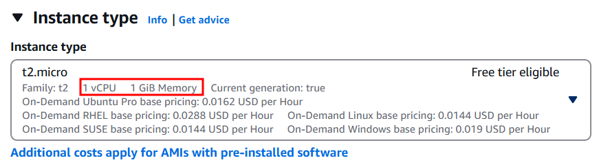
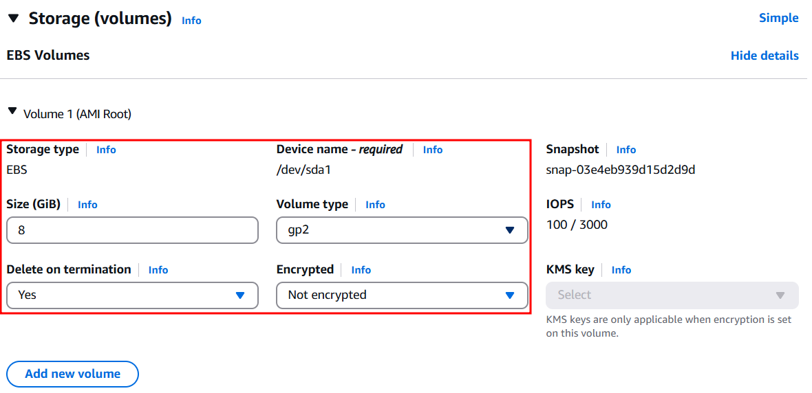
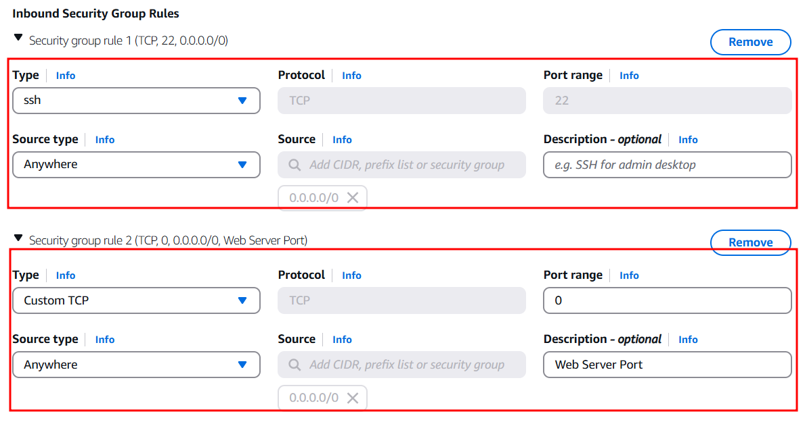
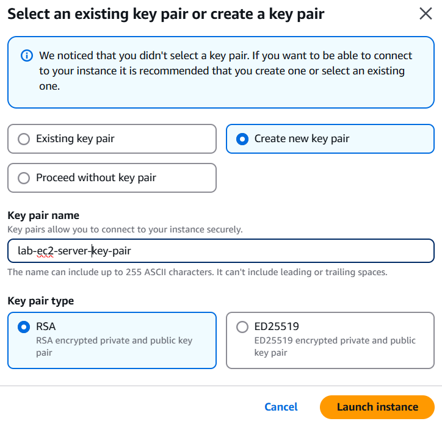
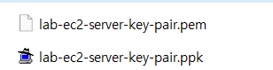
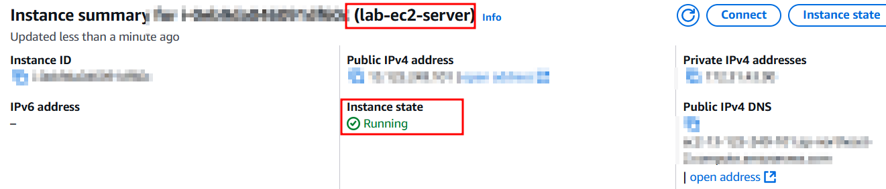
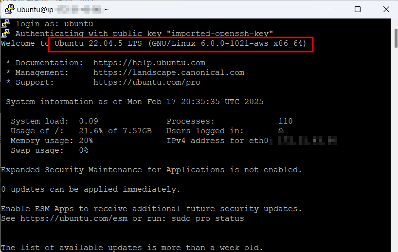

# 인스턴스 생성

## 인스턴스 이름 지정

## AMI 선택

인스턴스에 사용할 OS 및 소프트웨어 환경을 선택한다.

## 인스턴스 유형 선택

하드웨어 스펙을 선택한다. (아키텍처, CPU, 메모리, 스토리지)

## 스토리지(볼륨) 추가

기본적으로 선택한 AMI에 맞게 루트 볼륨이 설정 된다.

## 보안 그룹(방화벽 인바운드) 설정

## 키 페어 생성

## 인스턴스 접속

