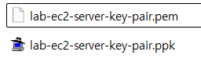
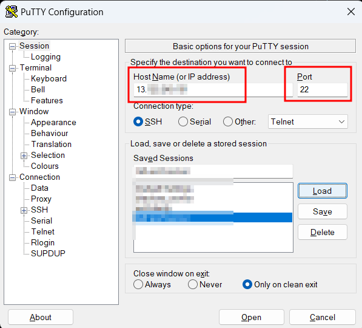
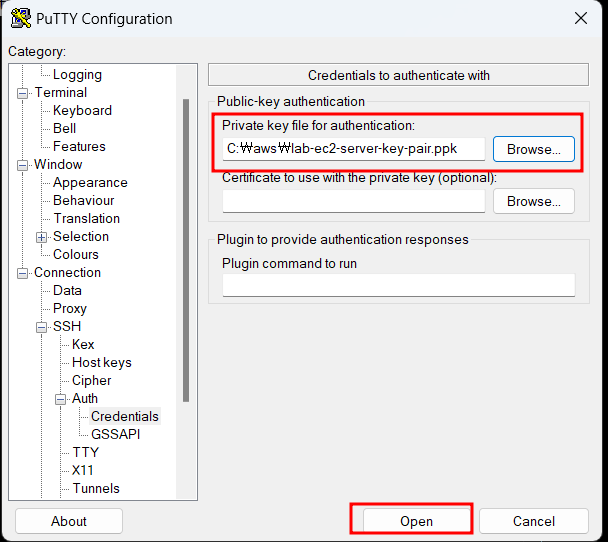
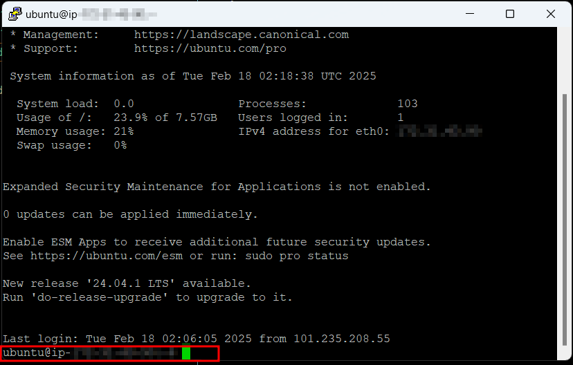
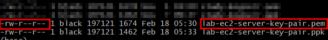
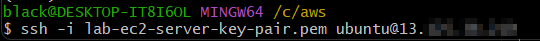
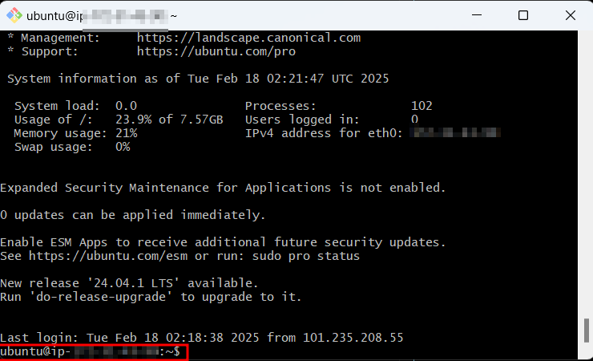

# SSH 원격 접속

## putty로 접속

pem 키로 ppk 키를 생성한다. (PuTTYgen을 이용하자.)



host, port 및 ppk로 원격 접속을 시도한다.







## ssh 명령어로 접속

pem 키의 권한 남용 여부를 체크한다. (권한 남용은 원격 접속 시 보안 정책에 제한될 수 있다.)



ssh 명령어로 원격 접속을 시도한다.

```
ssh -i pem username@host
```



