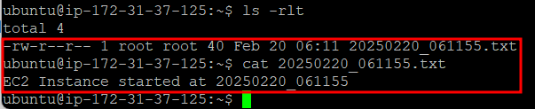

# User Data

## 특징

- EC2 인스턴스를 생성할 때 함께 실행시킬 수 있는 스크립트를 의미한다.
- 기본적으로 최초 인스턴스 부팅 시 1회만 실행된다. 여러번 실행하려면 cloud-init 설정을 수정해야 한다.
- 리눅스에서는 #!/bin/bash 스크립트를 작성해야 실행 가능하다.
- 윈도우에서는 PowerShell 또는 배치 파일을 실행 가능하다.

## 용도

- 개발/테스트 용 서버에 빠르게 패키지를 설치하거나 환경을 설정할 때 사용한다고 한다.
- 복잡한 설정이 필요한 환경, 업데이트가 잦은 환경, 오토 스케일링 환경에서는 사용을 지양해야 한다.
- 자주 사용할만한 기능으로는 딱히 메리트가 없다고 판단된다.