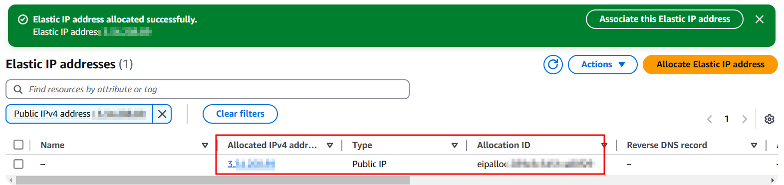
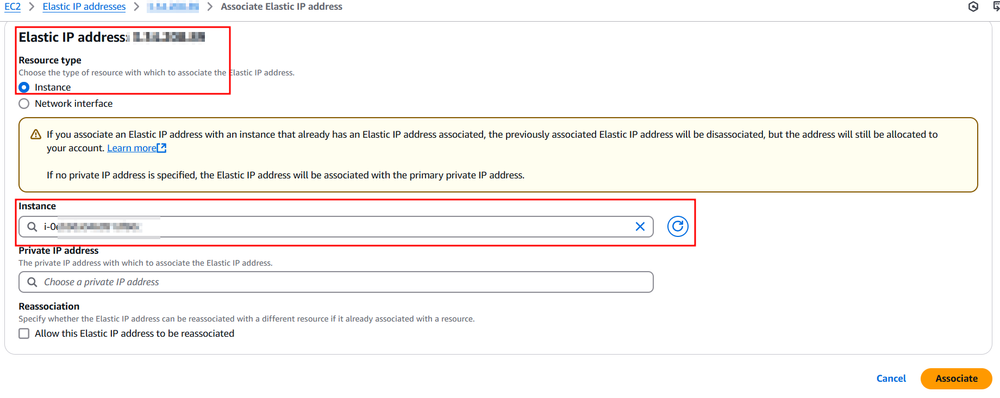
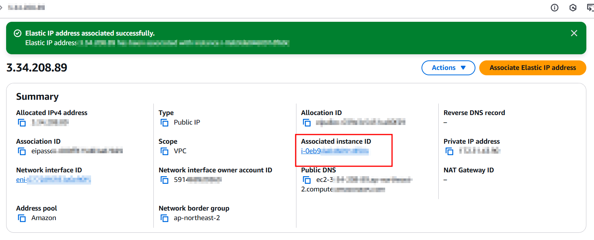
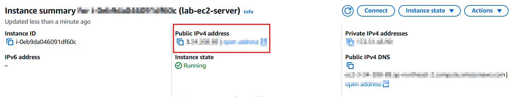
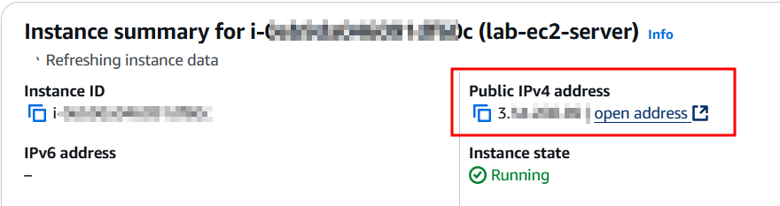

# Elastic IP 할당

## 특징

- 매번 인스턴스 생성 시 바뀌는 public ip를 방지하기 위해 Elastic IP를 통해서 고정된 public ip를 인스턴스에 부여할 수 있다.
- 고정된 public ip를 이용하기 때문에 매번 인스턴스 부팅 시 DNS 설정을 변경할 필요가 없다.

## 실습

리부트 전

리부트 후 동일 public ip 확인

