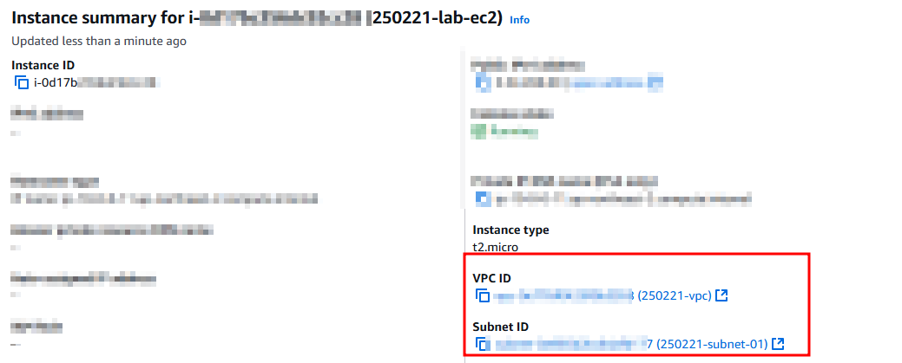

# VPC

## 특징

- AWS에서 EC2 인스턴스를 사용할 때, VPC를 통해서 네트워크 환경을 직접 설정할 수 있다.
- VPC는 AWS 내부에서 사용자의 독립적인 네트워크 공간을 의미한다.
- VPC는 AWS에서 제공하는 사용자 전용 가상 네트워크로, 온프레미스 환경에서의 네트워크와 유사하게 사용 가능하다.
- VPC 안에서 IP 범위를 설정하고 퍼블릿/프라이빗 네트워크를 구성할 수 있다.
- CIDR 블록 : VPC를 생성할 때, 사용할 IP 주소 범위를 지정해야 한다.
- 서브넷 : VPC 내부에서 더 작은 단위로 나눈 네트워크를 의미한다. 인터넷 연결 여부에 따라 퍼블릭/프라이빗 서브넷으로 나눌 수 있다.
- 라우트 테이블 : 퍼블릭 서브넷과 프라이빗 서브넷의 트래픽 흐름을 결정한다.
- 인터넷 게이트웨이(IGW) : 퍼블릭 서브넷이 인터넷에 접속할 수 있도록 지원한다.
- NAT 게이트웨이 : 프라이빗 서브넷이 인터넷에 접속할 수 있도록 지원한다.
- VPC 설정 과정 : VPC 생성 > 서브넷 생성 > IGW 연결 > 라우팅 테이블 설정

### VPC 설정

### EC2 - VPC 매핑

