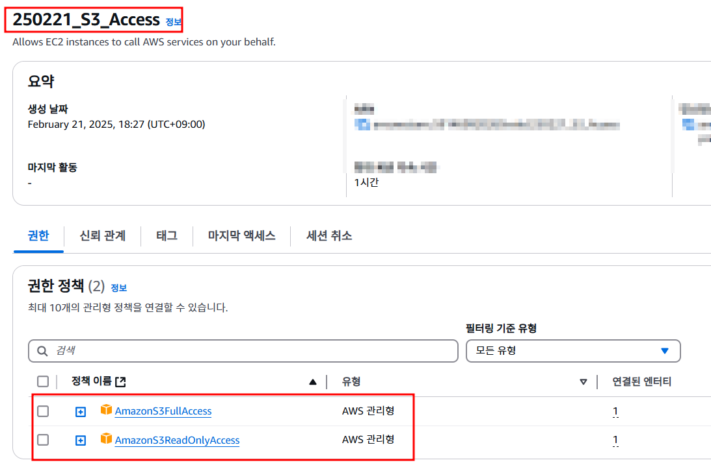
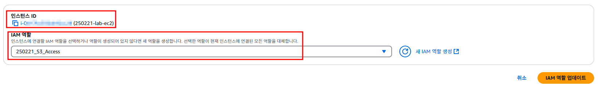
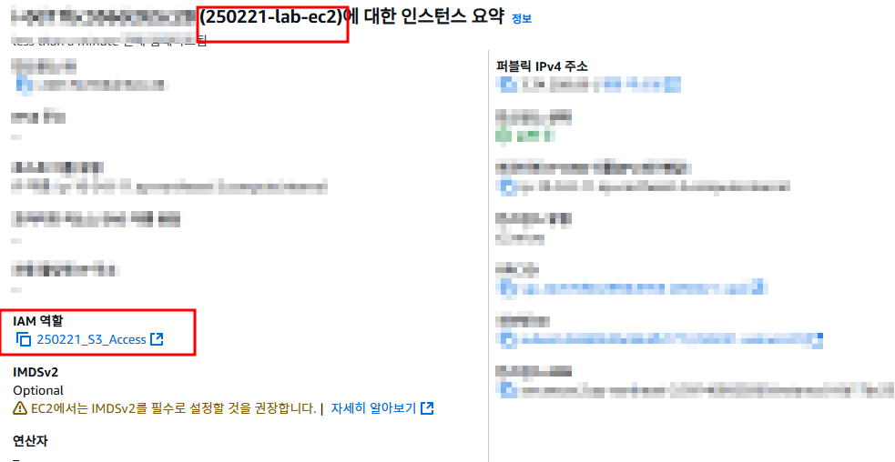
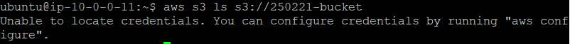
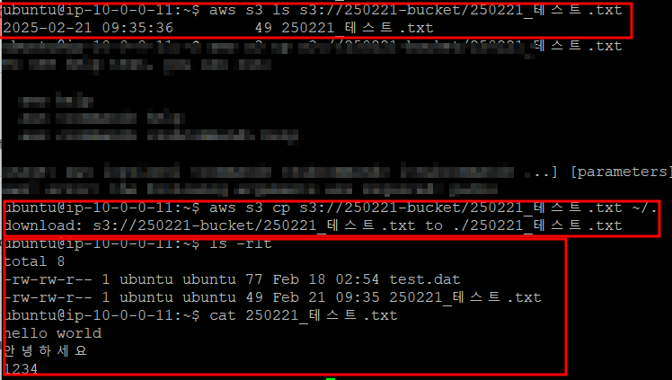

# IAM 권한 적용

## 특징

- IAM Role : 특정 AWS 서비스가 다른 AWS 서비스에 접근할 수 있도록 권한을 부여하는 역할.
- IAM Policy : 역할에 부여할 수 있는 권한을 정의한 문서(JSON 형식).
- ex) EC2가 S3 버킷 데이터를 읽을 수 있게 하려면, S3 접근 권한을 가진 IAM 역할을 EC2에 연결하면 된다.
- IAM Role을 사용하면 개인 액세스 키(Access Key)를 관리할 필요 없이 안전하게 AWS 서비스를 사용할 수 있다.
- IAM Role의 보안 토큰은 자동으로 갱신된다.
- IAM Role 설정을 변경하면 관련된 모든 인스턴스에 적용되어 일괄 관리가 가능하다.

## 설정

### 권한 부여 전

### 권한 부여 후

