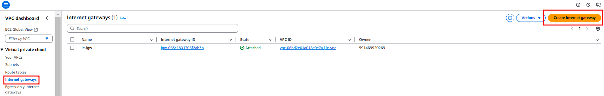
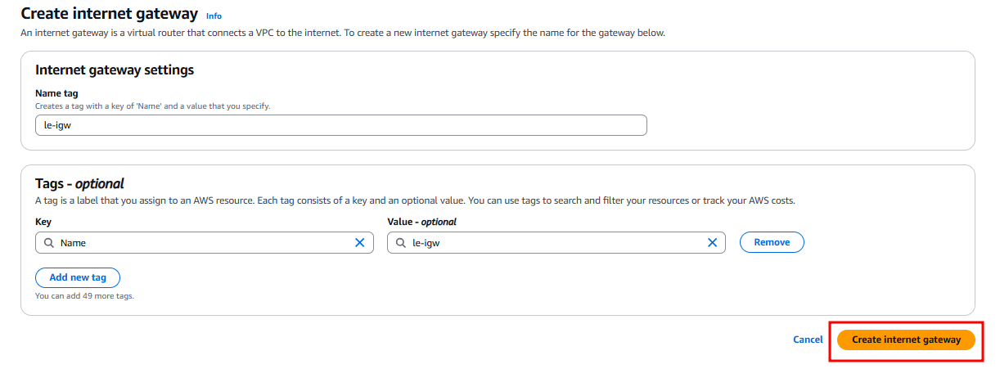
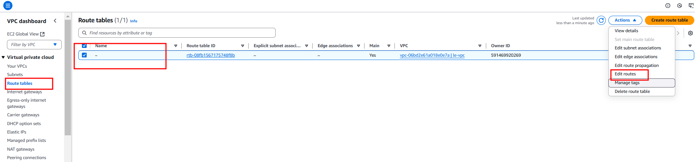
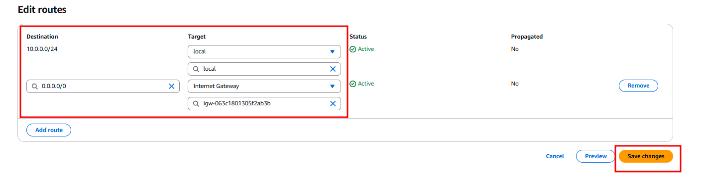
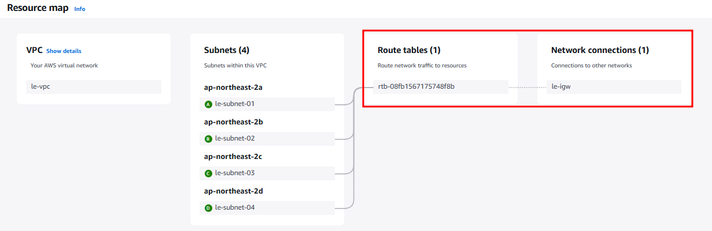

# IGW 적용

## 특징

- IGW(Internet Gateway)는 AWS VPC(Virtual Private Cloud)에서 인터넷과의 통신을 가능하게 해주는 리소스다.
- VPC는 기본적으로 외부 인터넷과 연결되어 있지 않다.
- IGW는 VPC의 서브넷과 연결된 인스턴스가 인터넷에 접근하거나 인터넷에서 VPC로 트래픽을 받을 수 있도록 하는 역할을 수행한다.

## 실습

### IGW 생성

### 라우팅 테이블에 IGW 적용

