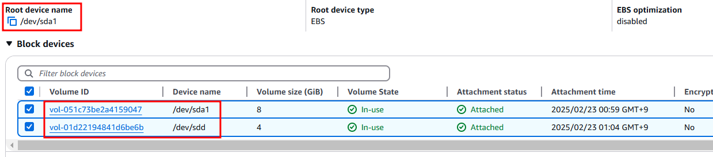
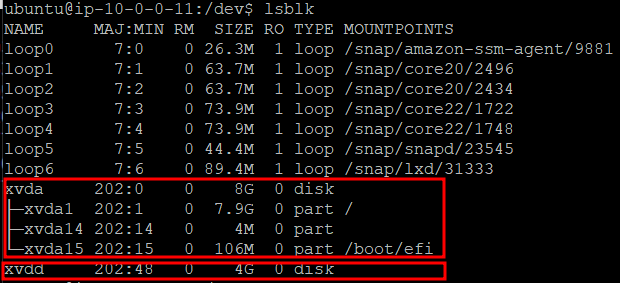
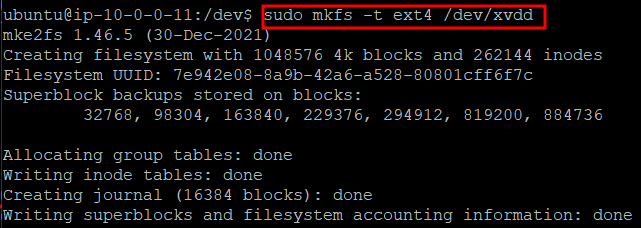
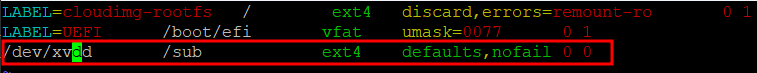
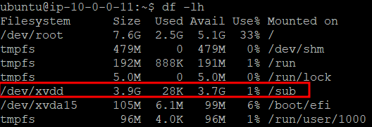
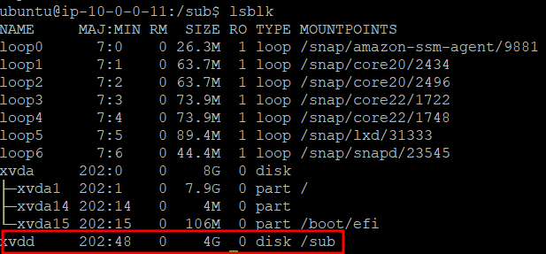

# EBS 볼륨 생성

## 특징

- EBS(Elastic Block Store)는 AWS에서 제공하는 블록 스토리지 서비스다.
- 스토리지를 EC2에 연결해서 데이터 저장 및 보관하는 디스크 역할을 수행한다.
- EBS의 볼륨 크기, 볼륨 유형, AZ를 설정한다.

- 리눅스 환경에서는 디스크를 감지할 때, 사용 중인 가상화 기술과 커널 드라이버에 따라 장치명을 자동으로 할당한다.
- AWS EC2는 Xen 가상화 기술을 기반으로 동작한다. Xen 가상화에서는 디스크가 기본적으로 xvd(Xen Virtual Device) 형태로 표시된다.
- Xen 가상화 방식을 사용하는 EC2의 EBS 볼륨명은 `/dev/sda` => `/dev/xvda1`, `/dev/sdd` => `/dev/xvdd` 형태로 정의된다.

## EBS 추가 실습

### EC2에 볼륨(EBS) 연결

루트 볼륨은 /dev/sda1, 신규 연결 볼륨은 /dev/sdd로 명명

### 볼륨에 파일 시스템 ex4 적용

### 디렉토리에 볼륨 마운트

/etc/fstab 수정 후 EC2 리부트

마운트 확인

