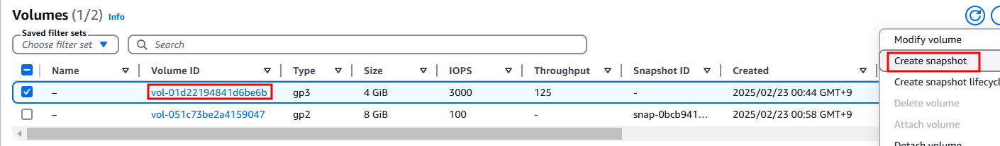
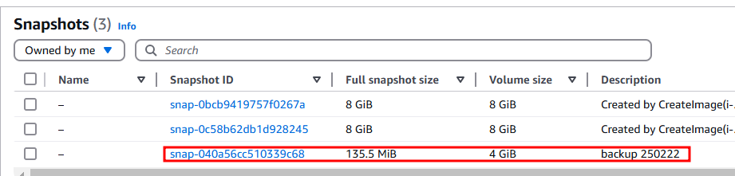
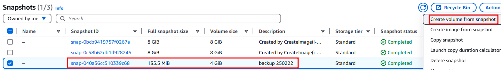
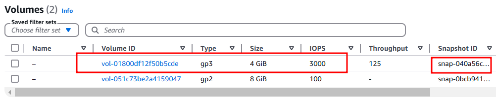
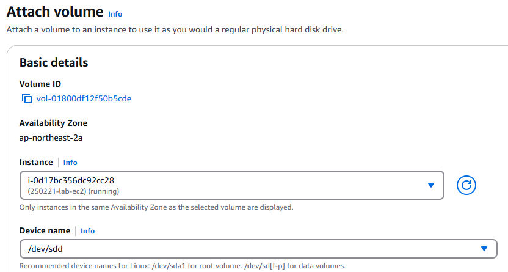
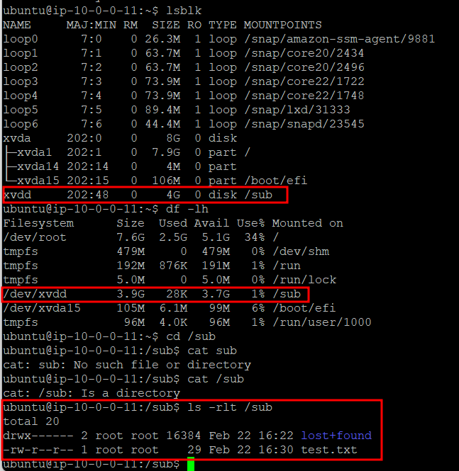

# EBS 스냅샷 생성 및 복원

## 특징

- 하드디스크를 그대로 복사해서 저장하는 것과 유사하다.
- 증분 백업 방식으로 동작한다. 처음에는 전체 데이터를 저장하고, 이후 변경된 부분만 저장하여 비용을 절감한다.
- S3에 저장되고 직접 접근은 불가하여 볼륨을 생성하여 마운트를 해서 확인해야 한다.

## 스냅샷 생성 실습

## 스냅샷 복원 실습

 

 

