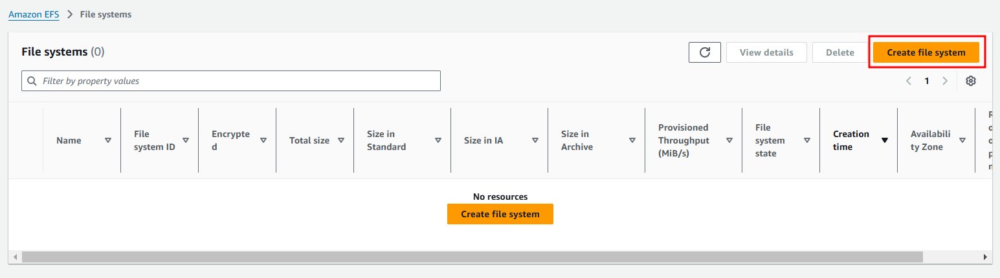

# EFS(Elastic File System) 적용

## 특징

- EFS 여러 EC2 인스턴스에서 `공유`해서 사용할 수 있는 `파일 시스템`이다.
- 용량을 미리 설정할 필요 없이, 사용량에 따라 자동으로 확장된다.
- AWS 리전 내에서 여러 AZ에 분산하여 저장되어서 장애에 강력하다.

## 실습

### VPC의 DNS 활성화

VPC 망 내에서 EFS라는 파일 시스템에 접근하기 위해서는 EFS의 DNS 명을 이용해야만 한다. VPC 내에서 DNS 명을 올바르게 해석하기 위해서 DNS 서비스를 활성화 시킨다. 이를 활성화 하지 않으면 DNS 명을 해석하지 못하기에 EC2 인스턴스에서 EFS에 붙지 못한다.


### EFS 전용 보안 그룹 생성

특정 SG에 소속되어 있는 EC2들만 EFS와 통신할 수 있도록 하기위해 EFS 전용 별도 SG를 생성한다.


### EFS 생성




 

 

 


### 일회성 EFS 마운트

```
sudo apt install -y nfs-common
```


### 영구 EFS 마운트

/etc/fstab 수정


https://docs.aws.amazon.com/ko_kr/efs/latest/ug/nfs-automount-efs.html

## 트러블 슈팅

### Ubuntu => EFS mount helper 적용 불가

EFS mount helper를 통해 EFS를 마운트 하려는 순간 아래의 에러가 발생하였다.

```
mount: /mnt/efs: unknown filesystem type 'efs'.
```


EFS mount helper를 이용하려면 아래의 패키지를 설치해야 하지만 Centos 계열에서만 이를 지원하므로 이용하지 못한다.

```
yum install -y amazon-efs-utils
```

때문에 내가 사용하는 Ubuntu 계열에서는 마운트를 위해 NFS client 방식을 이용해야 한다.

```
sudo apt install -y nfs-common
```


