# ELB 적용

## 특징

- ELB(Elastic Load Balancer)는 AWS에서 제공하는 부하 분산(Load Balancing) 서비스다.
- ELB는 들어오는 트래픽을 여러 EC2 인스턴스에 분산하여 높은 가용성과 확장성을 제공한다.
- 한 개의 EC2 인스턴스에 트래픽이 몰리면 처리 성능이 저하될 수 있다. 때문에 EC2 인스턴스를 여러개 두고 앞단에 ELB를 둬서 EC2들에게 트래픽을 분산할 수 있도록 해주어야 한다.
- 특정 인스턴스에 장애가 발생해도 ELB가 정상적인 인스턴스로 트래픽을 전달 가능하다.
- 오토 스케일링과 연계하면 EC2 인스턴스를 늘리거나 줄여서 자동으로 트개픽을 조절할 수 있다.
- ELB 유형은 ALB, NLB가 존재한다.
- ALB(Application Load Balancer) : 웹 서비스 및 API 용
- NLB(Network Load Balancer) : TCP/UDP 트래픽 분산 용
- ELB의 기능으로 헬스 체크가 존재한다. 주기적으로 대상 그룹내에 속해 있는 EC2 인스턴스들에게 요청을 보낸다. 그 요청 상태가 200으로 떨어지면 서버에 문제가 없다고 판단하고, 응답이 오지 않는다면 ELB 해당 인스턴스에게 요청을 보내지 않는다.

## 실습

### WAS ELB 생성

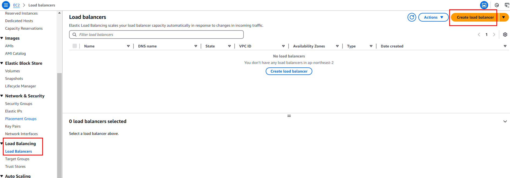

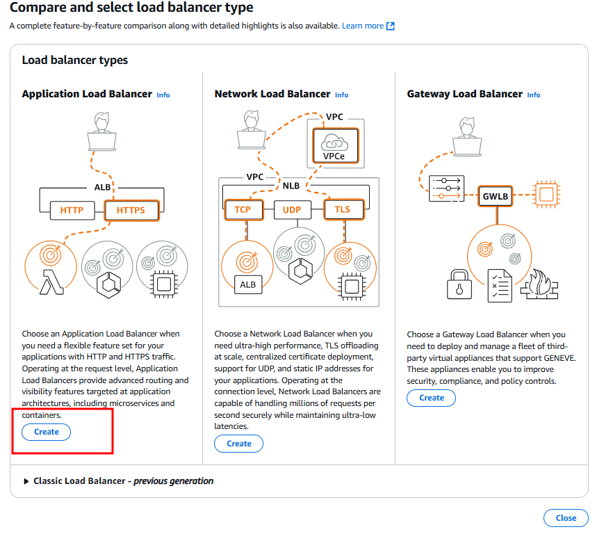

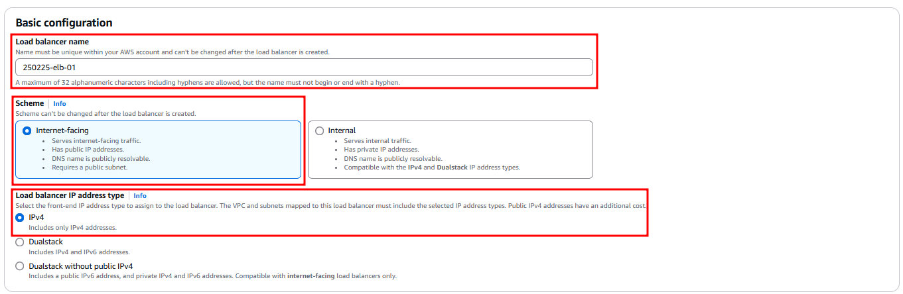

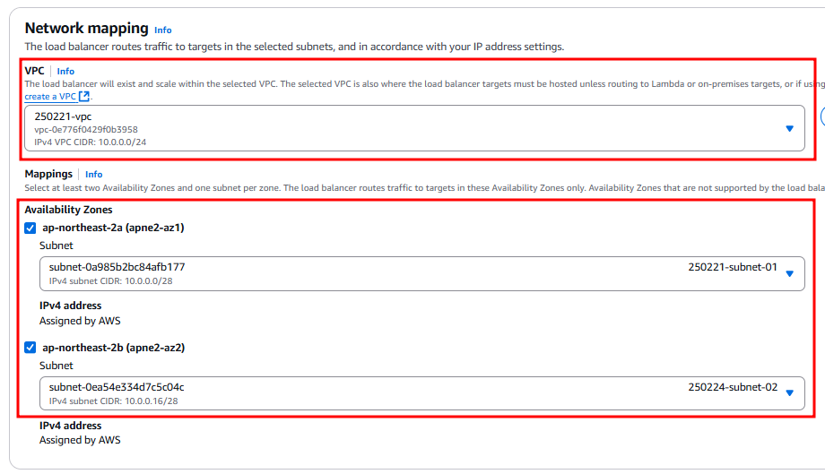

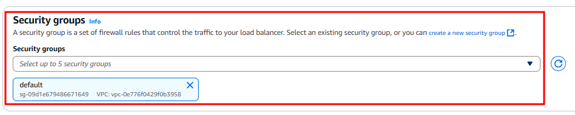

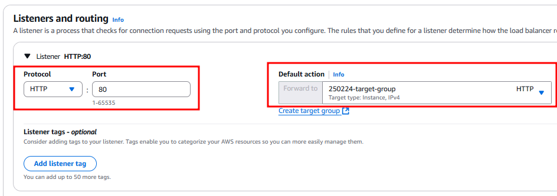

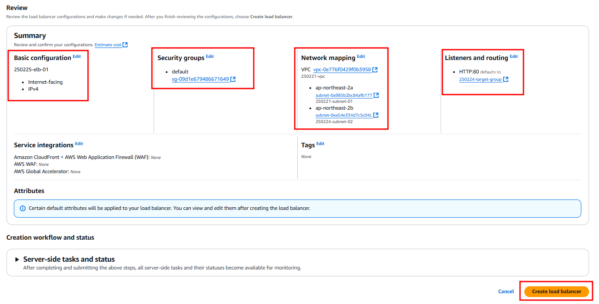

### 보안 그룹 생성

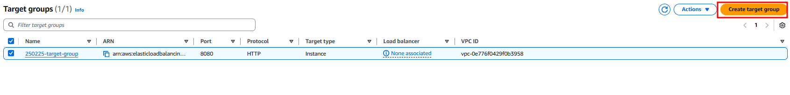

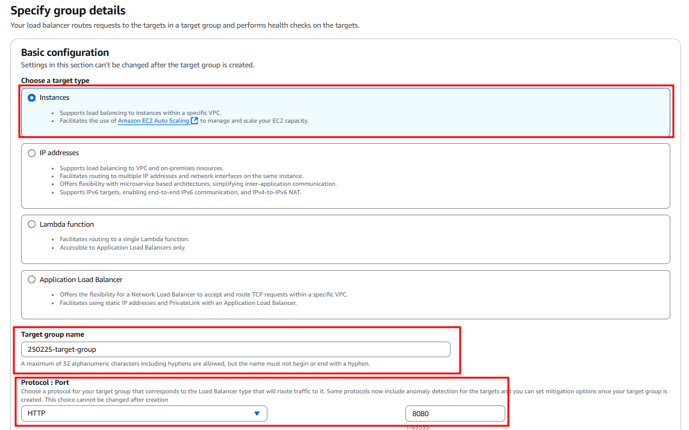

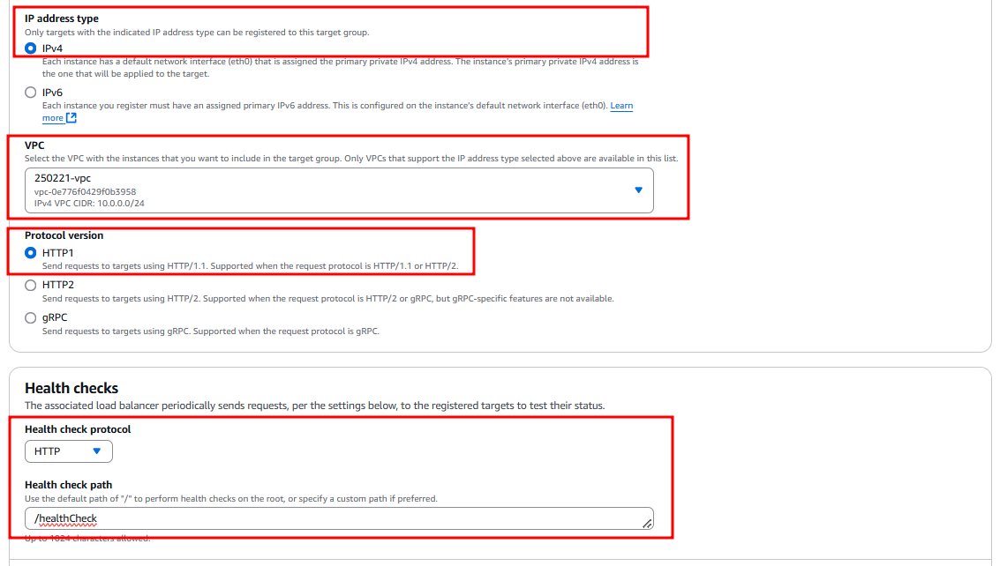

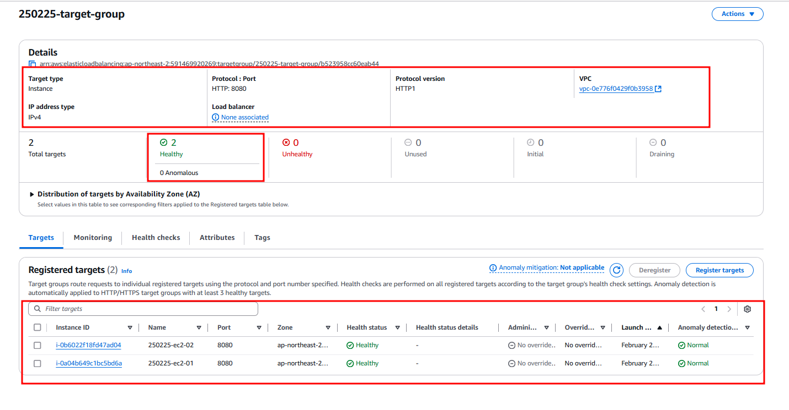

### ELB 요청 분산 확인

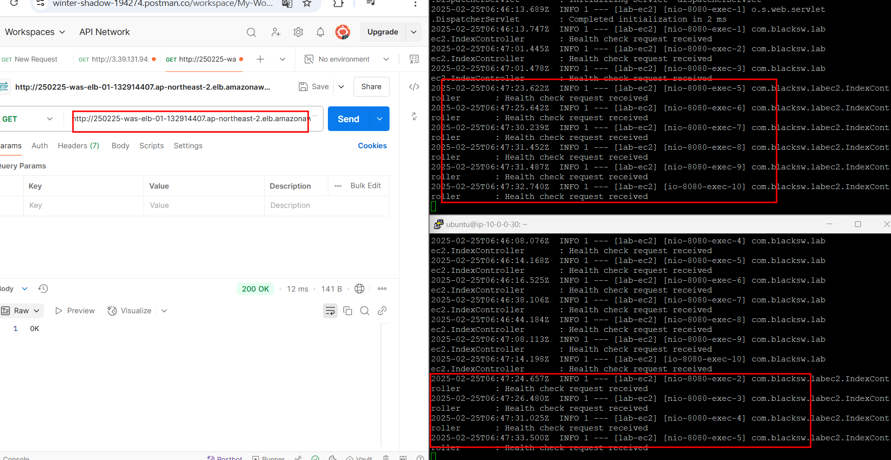