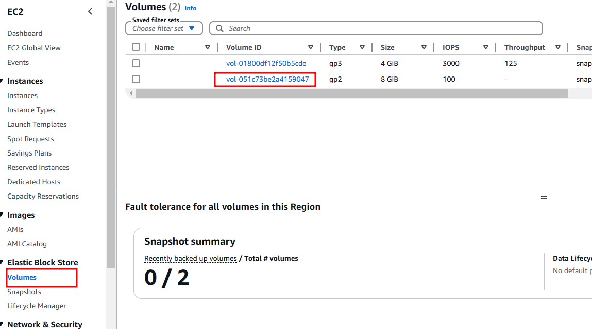
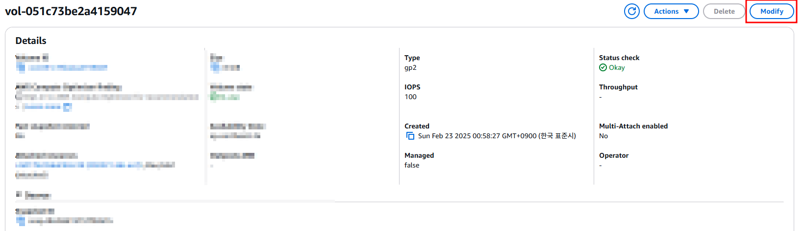
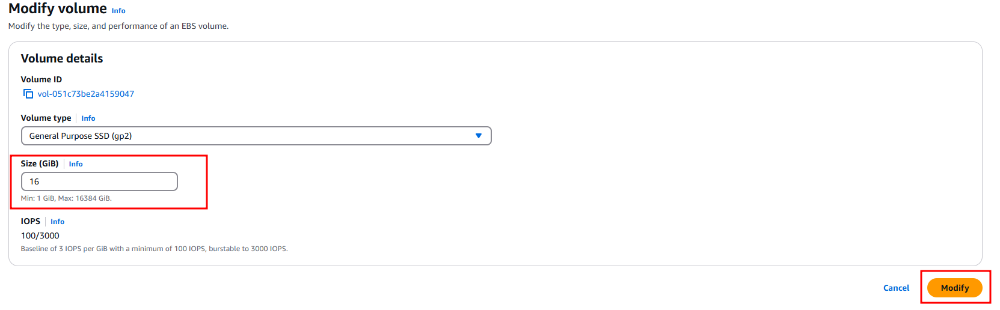
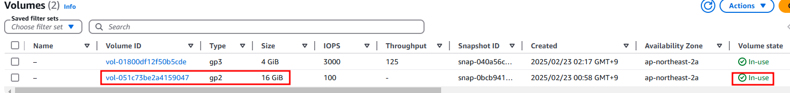
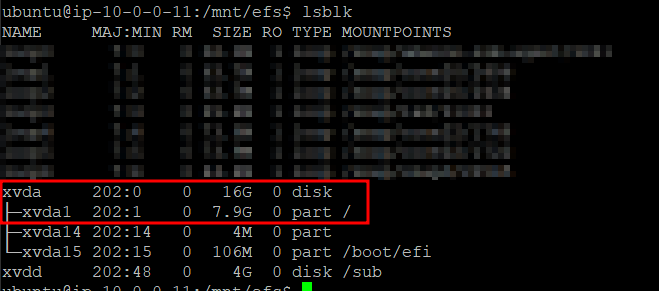
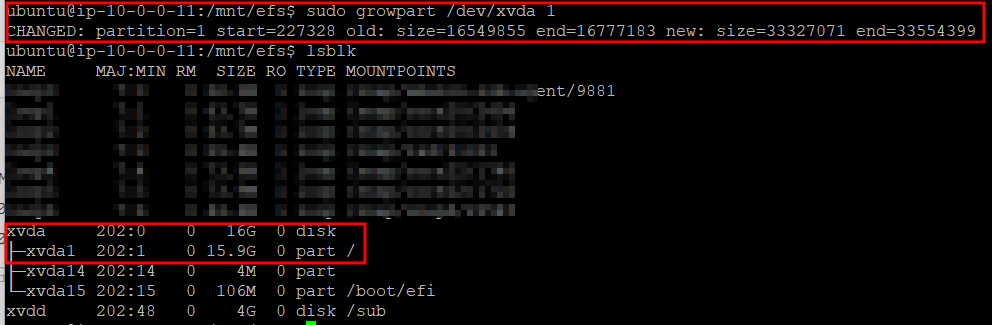
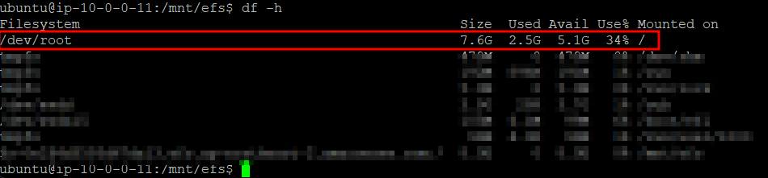
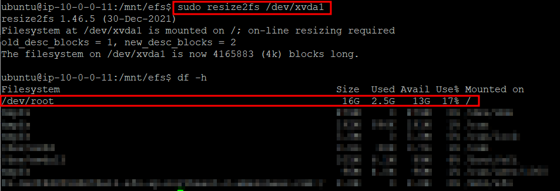
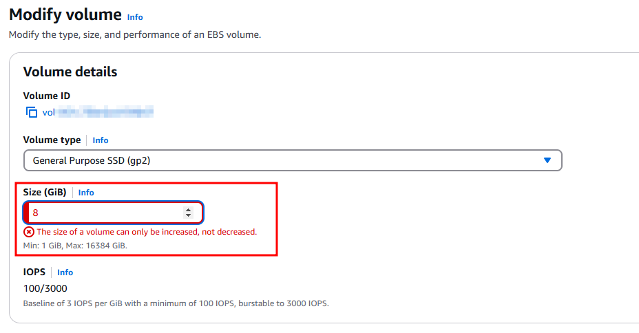

# 루트 볼륨 크기 확장

## 실습

### 수정 전

### 디스크 크기 수정

볼륨 크기는 정상적으로 반영이 되었으나, 아직 파티션은 이전 크기를 유지 중이다.

### 파티션 크기 수정

파티션은 볼륨을 증축한 크기만큼 확장하였으나, 파일 시스템은 이전 크기를 유지 중이다.

### 파일 시스템 크기 수정

최종적으로 파일 시스템 크기까지 볼륨 크기를 증축한 만큼 확장된 것을 확인할 수 있다.

## 주의사항

한번 증축한 볼륨에 대해서는 다시 크기를 축소시키는 것은 불가능하다. 볼륨 크기 확장 작업을 할 때는 반드시 사전에 스냅샷으로 백업을 해둬야 하고, 만약에 기존 볼륨에 대해서 크기를 줄여야만 하는 상황이 생긴다면 크기가 작은 새 볼륨을 생성해서 디스크 자체를 복사해줘야 하는 불편한 상황이 발생할 수 있으니 주의를 할 필요가 있다.

