# ELB SSL 적용

## 목표

- ELB에 SSL 인증서(CA: Let's Encrypt)를 부여하여 암복호화를 수행하도록 설정한다.

## 설명

### DNS-01란?

- `DNS-01` 인증 방식은 인증 기관(CA)이 도메인 소유권을 검증하는 방법 중 하나다.
- DNS 레코드(TXT)에 특정한 토큰 값을 추가하여 소유권을 증명하는 방식이다.

### 인증서 발급 과정

- Let's Encrypt는 해당 도메인의 소유권을 검증하기 위해 임의의 토큰 값(Challenge Token)을 생성한다.
- Let's Encrypt는 일정 시간이 지나면 도메인의 _acme-challenge.blacksw.site TXT 레코드를 조회한다.
- TXT 레코드의 값이 자신이 발급해준 임의의 토큰 값(Challenage Token)과 일치하면 해당 도메인의 소유자임을 인정한다.
- `nslookup -q=TXT _acme-challenage.blacksw.site` 와 같은 방식으로 도메인의 TXT 레코드를 검사한다.
- 도메인 소유권을 인증 받고나면 Let's Encrypt는 요청한 도메인에 대한 SSL/TLS 인증서를 발급해준다.
- 발급 이후 위에서 사용한 TXT 레코드는 유지하지 않아도 된다.

- Certbot이 AWS IAM 권한으로 Route 53에 TXT 레코드를 추가한다.
- Let's Encrypt가 추가한 TXT 레코드를 검증한 후 인증서를 발급한다.
- Certbot이 인증이 완료된 후, TXT 레코드를 삭제한다.

## 실습

### Route 53 DNS 레코드 Write 권한 추가

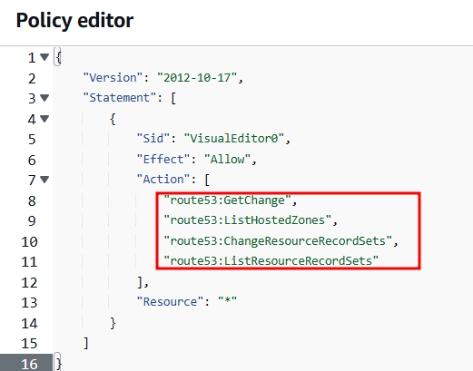

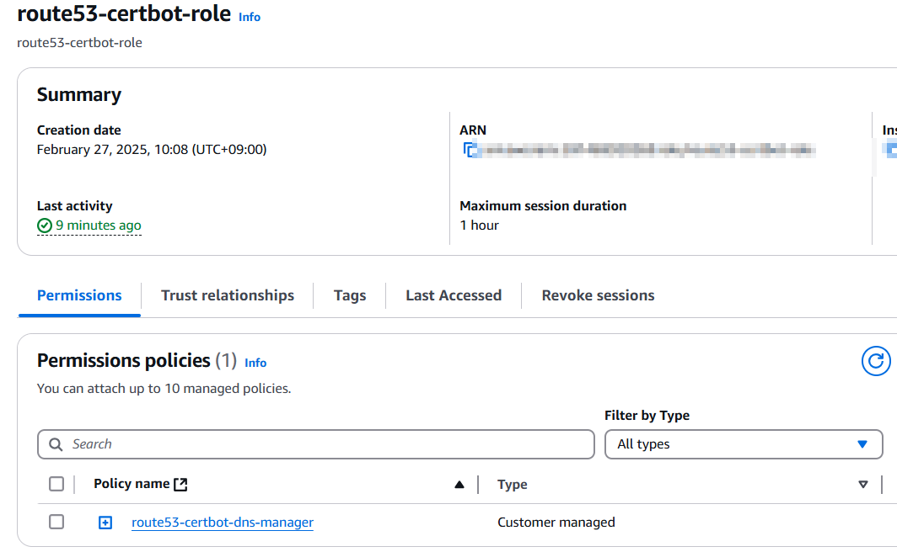

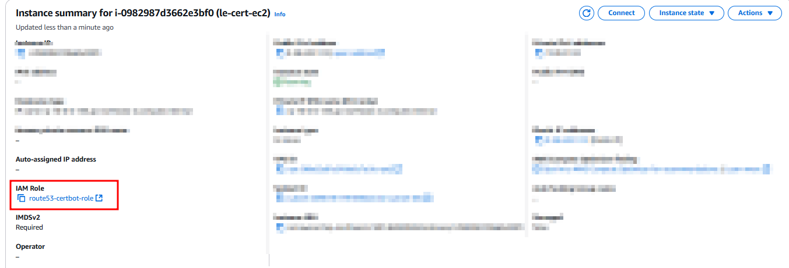

### 인증 서 발급

```
sudo apt update && sudo apt install -y certbot python3-certbot-dns-route53

sudo certbot certonly --dns-route53 -d blacksw.site
```

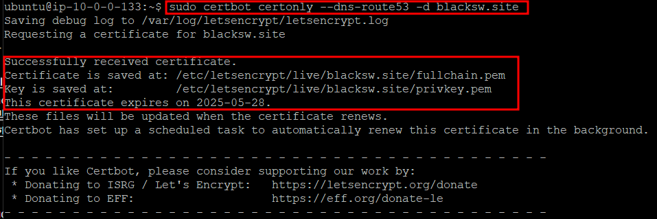

### aws cli 설치

```
sudo apt install curl unzip

curl "https://awscli.amazonaws.com/awscli-exe-linux-x86_64.zip" -o "awscliv2.zip"

unzip awscliv2.zip

sudo ./aws/install

aws --version
```

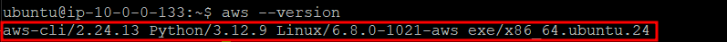

### ACM 임포트 권한 추가

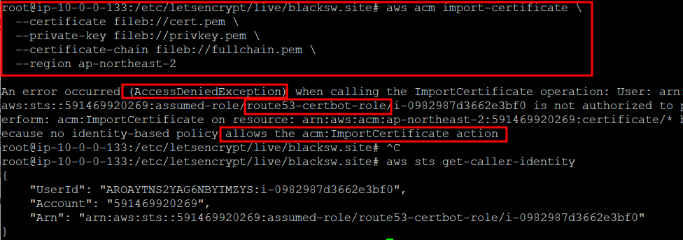

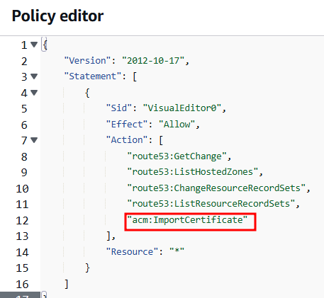

### ACM에 인증서 업로드

```
cd /etc/letsencrypt/live/blacksw.site

aws acm import-certificate \
  --certificate fileb://cert.pem \
  --private-key fileb://privkey.pem \
  --certificate-chain fileb://fullchain.pem \
  --region ap-northeast-2
```

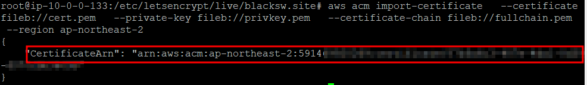

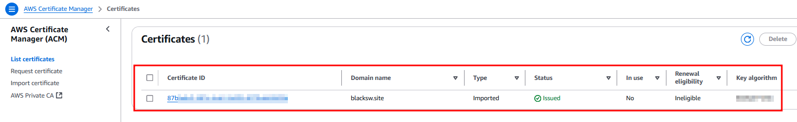

### ELB => HTTPS 443 포트 요청 리스너 설정

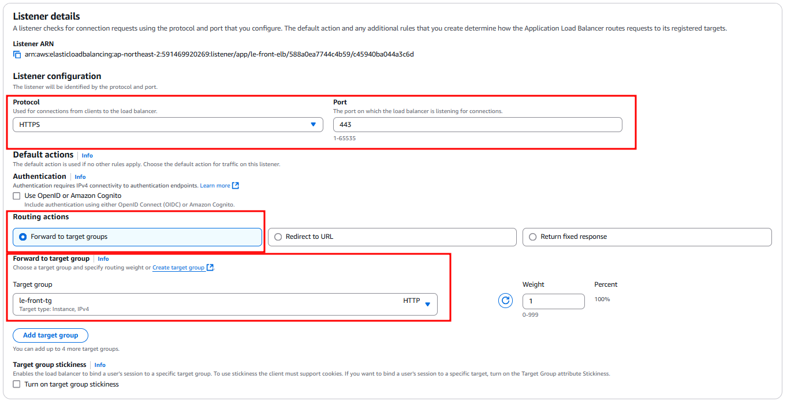

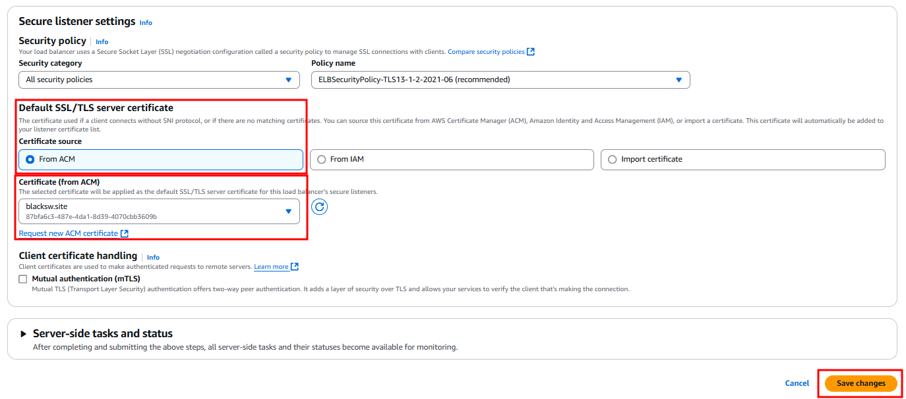

### ELB => HTTP 80 포트 요청 리스너 설정

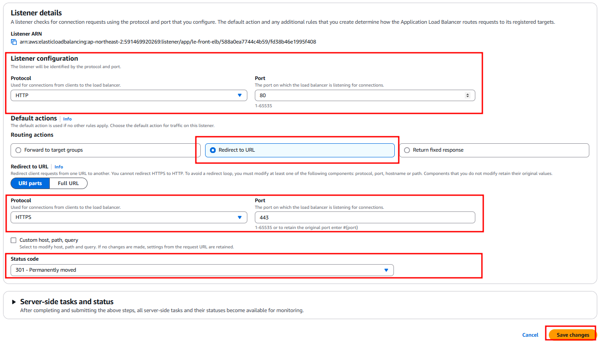

### ELB => Target Group 설정

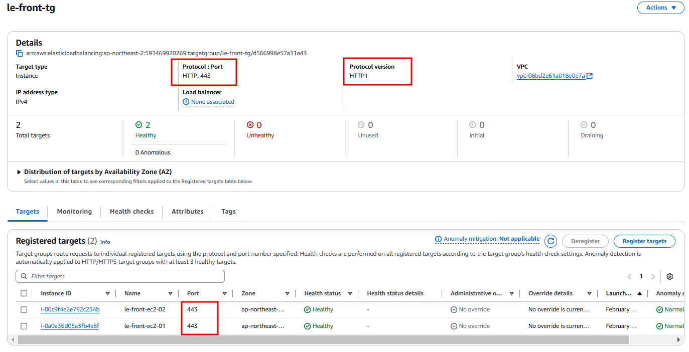

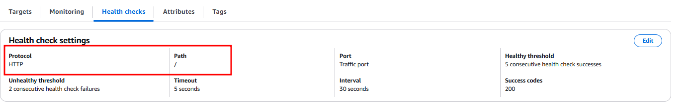

### 결과

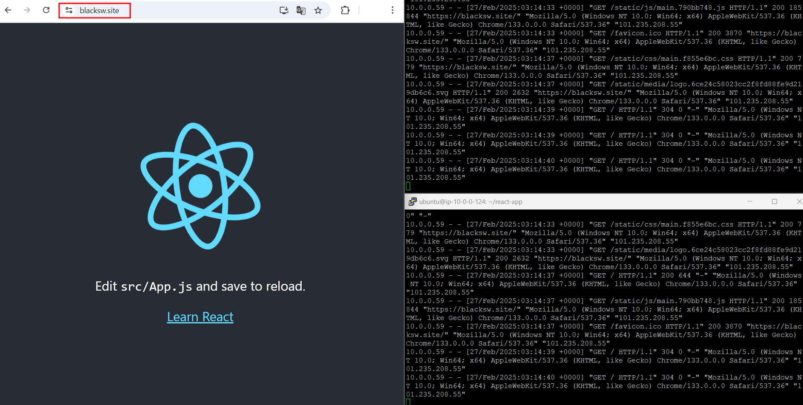

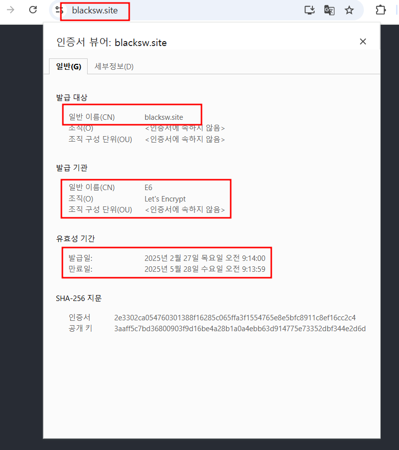