# ELB 오토 스케일링

## 설명

### 스케일링

- 스케일링이란 서버 인스턴스의 컴퓨팅 파워를 늘리는 것을 말한다.
- 스케일링의 종류로는 스케일 업과 스케일 아웃이 있다.
- 스케일 업은 인스턴스 하나의 성능을 높혀서 컴퓨팅 파워를 증가시키는 방법이다.
- 스케일 아웃은 여러개의 인스턴스를 붙여서 컴퓨팅 파워를 증가시키는 방법이다.

### 오토 스케일링

- 클라우드 컴퓨팅의 대표적 장점은 필요에 따라 서비스의 규모를 빠르게 확장 및 축소가 가능하다는 점이다.
- 오토 스케일링(Auto Scaling)은 CPU, 메모리, 디스크, 네트워크 트래픽 같은 시스템 자원들의 메트릭(Metric) 값을 모니터링해서 서버의 규모를 자동으로 조절하는 클라우드 서비스를 말한다.
- 오토 스케일링 기능을 통해 예상치 못한 서비스 부하에 대응하거나 최대한 저렴한 비용으로 서비스를 유지할 수 있다.
- 오토 스케일링은 스케일 아웃을 자동화하기 위해 나온 클라우드 서비스다.
- 애플리케이션을 모니터링하고 용량을 자동으로 조정하는 역할을 하며, 최대한 저렴한 비용으로 안정적이고 예측 가능한 성능을 유지한다.
- 오토 스케일링 그룹은 인스턴스의 최소 및 최대 수와 원하는 인스턴스 수를 지정하고 이 범위 안에서 스케일 인/아웃이 발생한다.
- 런치 템플릿은 AMI와 비슷한 개념으로, 오토 스케일링 서비스에서 같은 환경의 인스턴스를 복제하기 위해 구성한다.
- 런치 템플릿을 오토 스케일링 그룹에 지정함으로서, 스케일 아웃을 통해 인스턴스를 늘리게 되면 템플릿에 설정된 환경에 맞춰 복제를 하여 서비스를 확장하게 된다.

## 실습

### Launch Template 생성

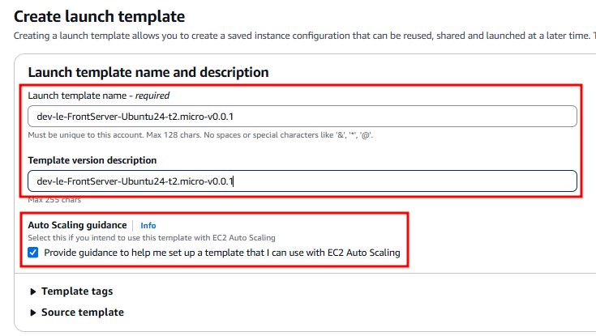

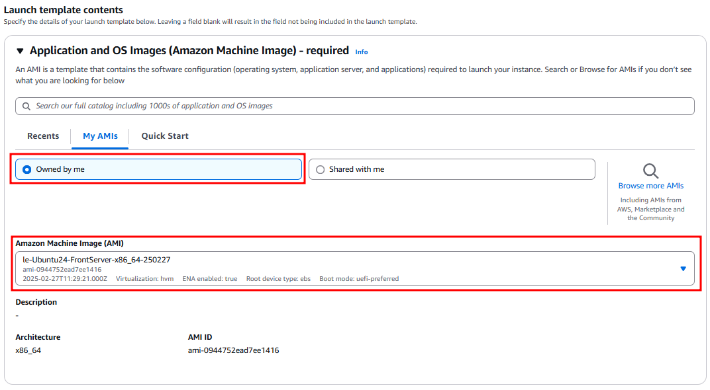

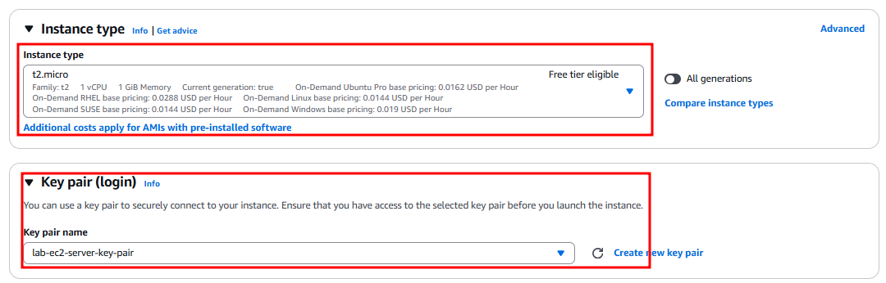

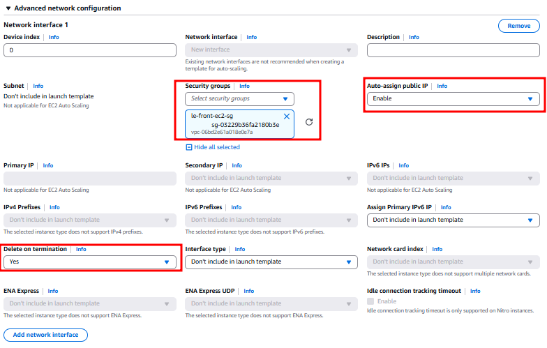

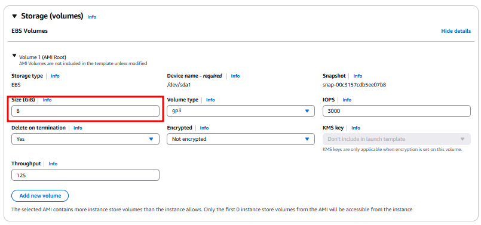

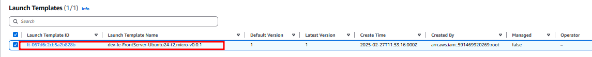

### 오토 스케일링 그룹 생성

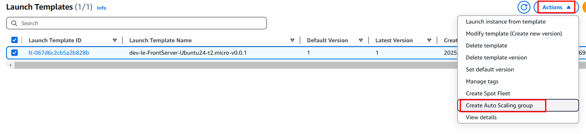

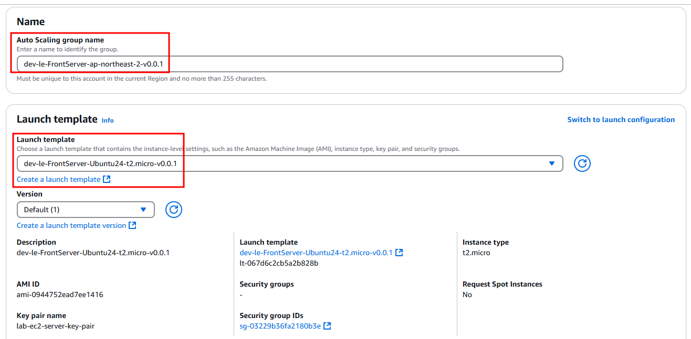

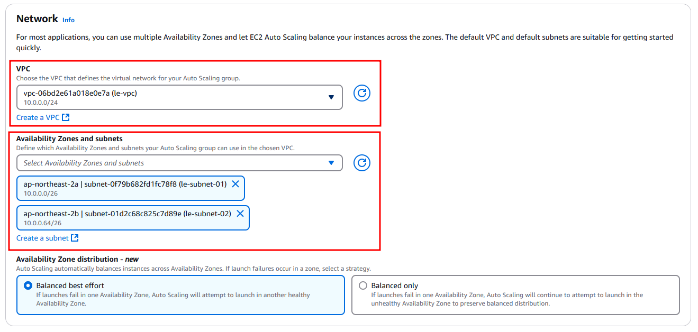

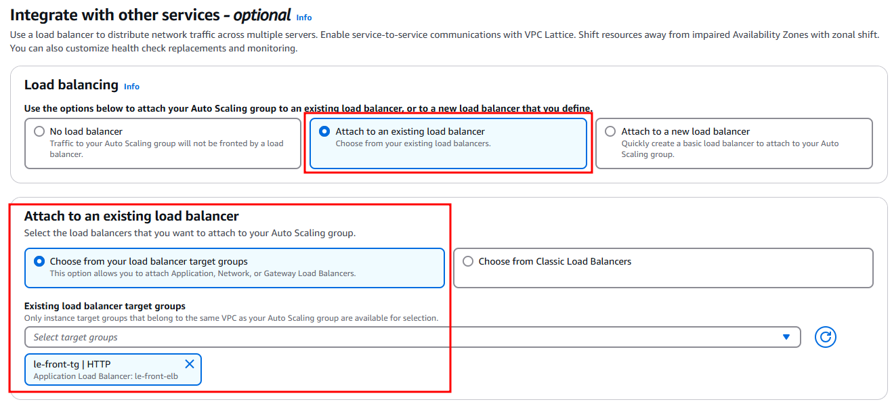

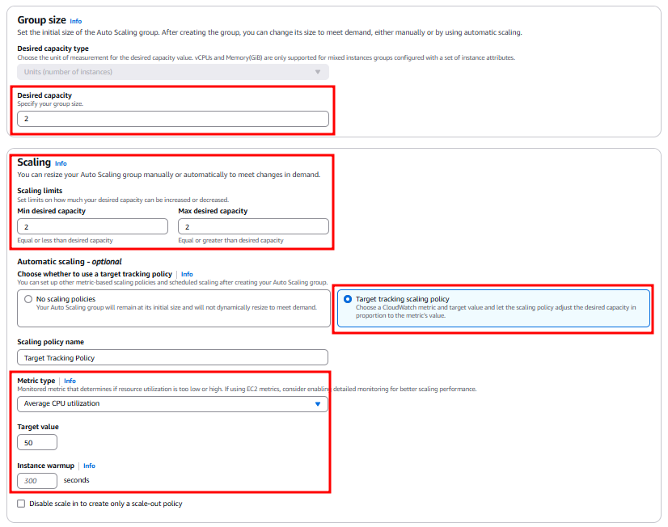

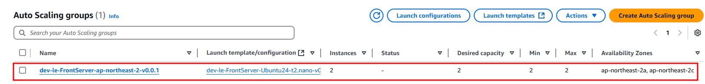

### 결과

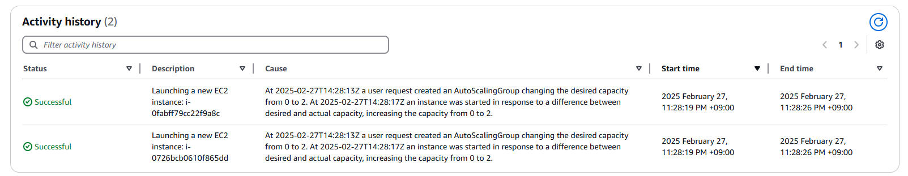

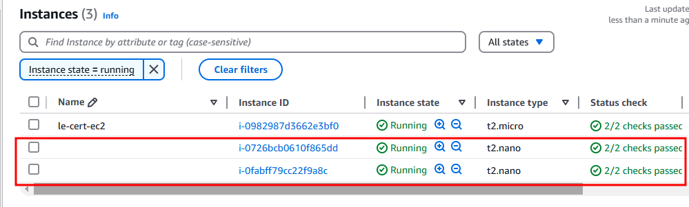

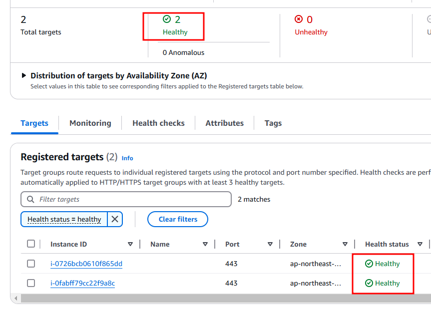

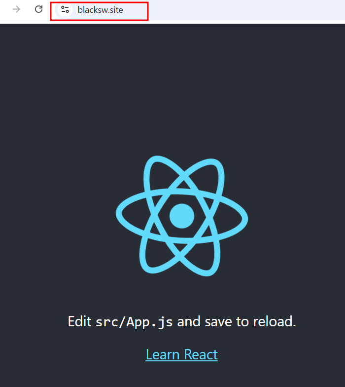